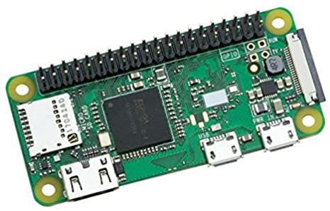
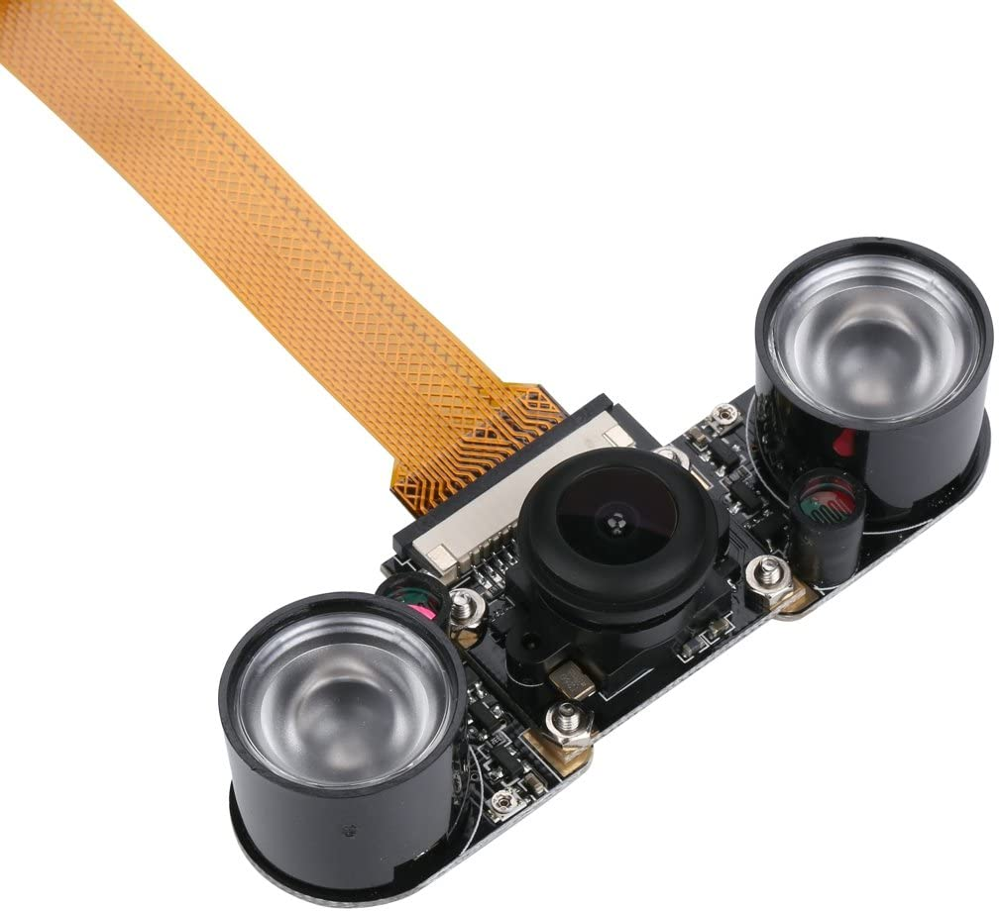
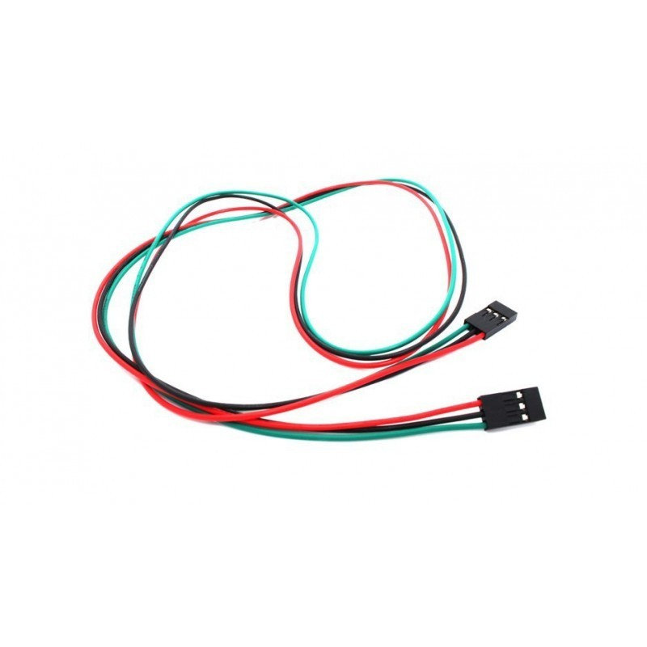
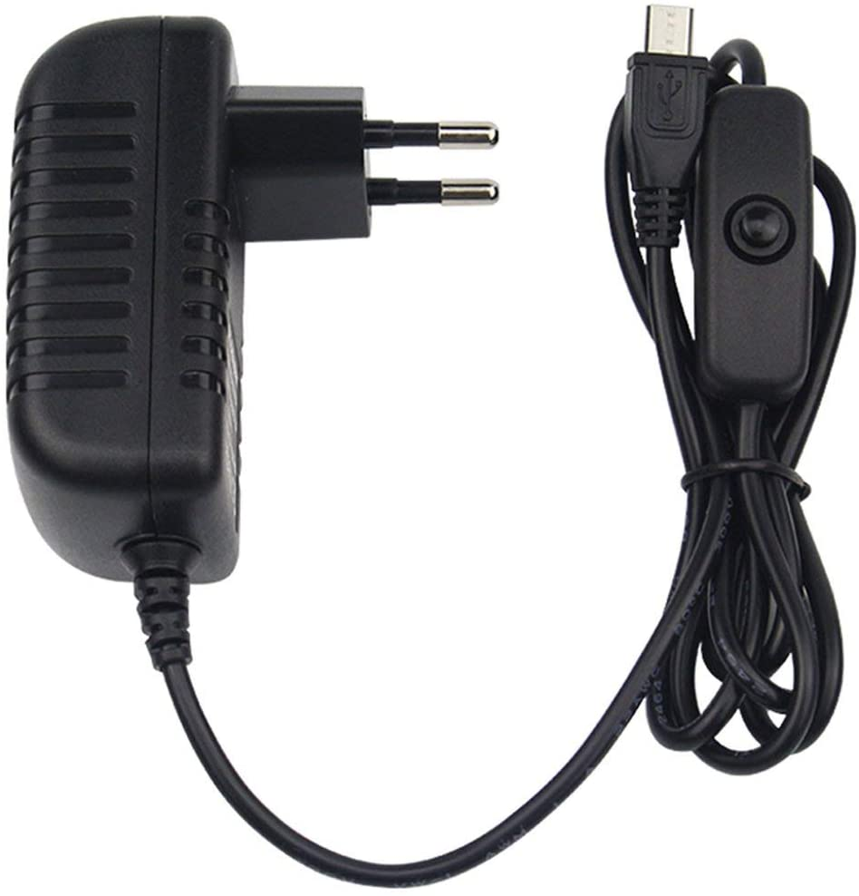

# rodocam
Raspberry Pi Zero Caméra Fisheye grand angle 5 MP 1080p Vision nocturne Module

Hardware:

- 1 x raspberry pi zero wh = 27,90€ 

- 1 x infrared fisheye caméra 5MP 1080p (OV5647) = 30€

- 1 x hc-SR501 PIR motion sensor = 3€

- 3 x female->female dupont wires

- 1 x USB-C 5v 3a alim.

1. plug PIR vcc to RPI pin#4 (5v power)
2. plug PIR gnd to RPI pin#6 (Ground)
3. plug PIR signal to RPI pin#11 (GPIO 17)
4. plug camera to raspberry hdmi in
5. plug raspberry to 5v power
